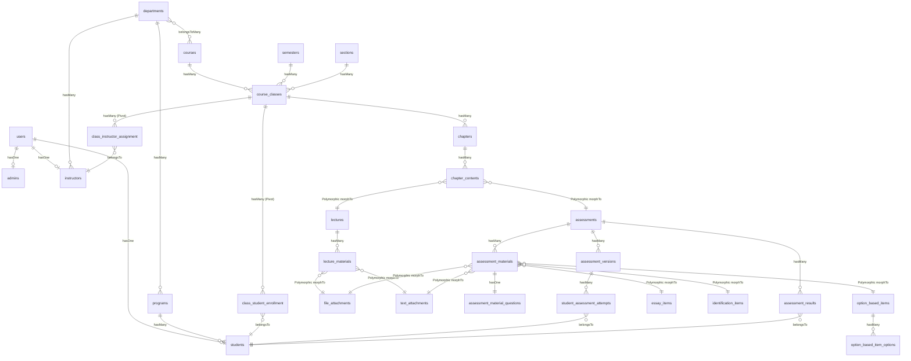

# CentraLearn Backend: Database Schema & Relationships

This document provides a detailed description of the database structure of the CentraLearn LMS project, and how each table relates to the others based on the migrations and Eloquent models.

## Entity Relationship Diagram

---

## 1. User Management & Roles

The system uses a central `users` table, which is extended into specific entities via a one-to-one mapping strategy.

### **Users (`users` table / `User` model)**
The foundational entity for authentication.
- **Key Columns**: `id` `uuid`, `first_name`, `last_name`, `address`, `email`, `password`.
- **Relationships**:
  - `hasOne` **Admin**
  - `hasOne` **Instructor**
  - `hasOne` **Student**
- *Note: Uses Spatie Laravel-Permission tables (`roles`, `permissions`, `model_has_roles`, etc.) for authorization.*

### **Admins (`admins` table / `Admin` model)**
- **Key Columns**: `id` `uuid`, `user_id` `uuid FK`, `job_title`.
- **Relationships**:
  - `belongsTo` **User**

### **Students (`students` table / `Student` model)**
- **Key Columns**: `id` `uuid`, `user_id` `uuid FK`, `program_id` `uuid FK`.
- **Relationships**:
  - `belongsTo` **User**
  - `belongsTo` **Program**
  - `hasMany` **ClassStudentEnrollment** (maps enrollment to Course Classes)
  - `hasMany` **StudentAssessmentAttempt**
  - `hasMany` **AssessmentResult**

### **Instructors (`instructors` table / `Instructor` model)**
- **Key Columns**: `id` `uuid`, `user_id` `uuid FK`, `department_id` `uuid FK`, `job_title`.
- **Relationships**:
  - `belongsTo` **User**
  - `belongsTo` **Department**
  - `hasMany` **ClassInstructorAssignment** (maps assignment to Course Classes)

---

## 2. Institutional Structure

### **Departments (`departments` table / `Department` model)**
- **Key Columns**: `id` `uuid`, `name`, `description`, `code`, `image_url`.
- **Relationships**:
  - `hasMany` **Program**
  - `hasMany` **Instructor**
  - `belongsToMany` **Course** (via `course_department` pivot table)

### **Programs (`programs` table / `Program` model)**
Specific degree or study paths under a department.
- **Key Columns**: `id` `uuid`, `department_id` `uuid FK`, `name`, `code`.
- **Relationships**:
  - `belongsTo` **Department**
  - `hasMany` **Student**

---

## 3. Course and Class Organization

### **Courses (`courses` table / `Course` model)**
The base definition/catalog of a course.
- **Key Columns**: `id` `uuid`, `name`, `description`, `code`, `image_url`.
- **Relationships**:
  - `belongsToMany` **Department**
  - `hasMany` **CourseClass**

### **Semesters (`semesters` table / `Semester` model)**
- **Key Columns**: `id` `uuid`, `name`, `start_date`, `end_date`.
- **Relationships**:
  - `hasMany` **CourseClass**

### **Sections (`sections` table / `Section` model)**
Class blocks (e.g. Block A, Block B).
- **Key Columns**: `id` `uuid`, `name`.
- **Relationships**:
  - `hasMany` **CourseClass**

### **Course Classes (`course_classes` table / `CourseClass` model)**
This forms the actual operational class (e.g., Course 101, Semester 1, Block A).
- **Key Columns**: `id` `uuid`, `course_id` `uuid FK`, `semester_id` `uuid FK`, `section_id` `uuid FK`, `status` (`enum: open, close`).
- **Relationships**:
  - `belongsTo` **Course**, `belongsTo` **Semester**, `belongsTo` **Section**.
  - `hasMany` **Chapter**
  - `hasMany` **ClassStudentEnrollment** (Enrollments)
  - `hasMany` **ClassInstructorAssignment** (Assigned instructors)
  - `hasManyThrough` **Instructor**, `hasManyThrough` **Student**

### Pivots for Participation
- **Class Instructor Assignment (`class_instructor_assignment` table)**: Links `course_class_id` and `instructor_id`.
- **Class Student Enrollment (`class_student_enrollment` table)**: Links `course_class_id` to `student_id`. Also tracks `final_grade`.

---

## 4. Class Curriculum

### **Chapters (`chapters` table / `Chapter` model)**
Modules within a Course Class.
- **Key Columns**: `id` `uuid`, `course_class_id` `uuid FK`, `name`, `order`, `published_at`.
- **Relationships**:
  - `belongsTo` **CourseClass**
  - `hasMany` **ChapterContent**

### **Chapter Contents (`chapter_contents` table / `ChapterContent` model)**
A polymorphic table that stores the sequence of items inside a Chapter.
- **Key Columns**: `id` `uuid`, `chapter_id` `uuid FK`, `contentable_type`, `contentable_id` (Polymorphic), `order`, `publishes_at`, `opens_at`, `closes_at`.
- **Relationships**:
  - `belongsTo` **Chapter**
  - `morphTo` **Contentable** (Links to a **Lecture** or an **Assessment**)

---

## 5. Lectures and Assessments

### **Lectures (`lectures` table / `Lecture` model)**
- **Key Columns**: `id` `uuid`.
- **Relationships**:
  - `morphOne` **ChapterContent**
  - `hasMany` **LectureMaterial**

### **Assessments (`assessments` table / `Assessment` model)**
- **Key Columns**: `id` `uuid`, `time_limit`, `assessment_materials_hash`, `max_achievable_score`, `max_attempts`, `multi_attempt_grading_type`.
- **Relationships**:
  - `morphOne` **ChapterContent**
  - `hasMany` **AssessmentMaterial**
  - `hasMany` **AssessmentVersion**
  - `hasMany` **AssessmentResult**

---

## 6. Materials polymorphism (Content details)

### **Lecture Materials (`lecture_materials` table / `LectureMaterial` model)**
Items within a Lecture.
- **Key Columns**: `id` `uuid`, `lecture_id` `uuid FK`, `materialable_type`, `materialable_id`, `order`.
- **Relationships**:
  - `belongsTo` **Lecture**
  - `morphTo` **Materialable** (Polymorphism pointing to **FileAttachment** or **TextAttachment**).

### **Assessment Materials (`assessment_materials` table / `AssessmentMaterial` model)**
Questions or items within an assessment.
- **Key Columns**: `id` `uuid`, `assessment_id` `uuid FK`, `materialable_type`, `materialable_id`, `order`, `point_worth`.
- **Relationships**:
  - `belongsTo` **Assessment**
  - `hasOne` **AssessmentMaterialQuestion** (Holds context/question text)
  - `morphTo` **Materialable** (Points to `OptionBasedItem`, `EssayItem`, `IdentificationItem`, `FileAttachment`, or `TextAttachment`).

### **Attachments**
- **File Attachments (`file_attachments` table / `FileAttachment` model)**: Reusable static files.
- **Text Attachments (`text_attachments` table / `TextAttachment` model)**: Reusable text blocks.

---

## 7. Assessment Question Types

- **Assessment Material Questions (`assessment_material_questions` table)**: Contains `question_text` and `question_files`. Follows `AssessmentMaterial`.
- **Option Based Items (`option_based_items` table)**: Base setup for Multiple Choice/Checkbox items. Has many `option_based_item_options` (which define choices, `option_text`, `is_correct` boolean, etc).
- **Essay Items (`essay_items` table)**: Stores rule parameters like minimum and maximum word or character counts.
- **Identification Items (`identification_items` table)**: Stores `accepted_answers` (JSON) and `is_case_sensitive` validation bounds.

---

## 8. Quiz Taking & Grading

To prevent data corruption if an assessment is altered while students are taking it, the database versions it.

### **Assessment Versions (`assessment_versions` table / `AssessmentVersion` model)**
Snapshots of assessment questions and answers.
- **Key Columns**: `id` `uuid`, `assessment_id` `uuid FK`, `version_number`, `questionnaire_snapshot` (JSON array of questions minus answers), `answer_key` (JSON), `max_achievable_score`.
- **Relationships**:
  - `belongsTo` **Assessment**
  - `hasMany` **StudentAssessmentAttempt**

### **Student Assessment Attempts (`student_assessment_attempts` table / `StudentAssessmentAttempt` model)**
Ongoing or finished student submissions against a specific version.
- **Key Columns**: `id` `uuid`, `student_id` `uuid FK`, `assessment_version_id` `uuid FK`, `answers` (JSON), `attempt_number`, `status` (ongoing/submitted), `total_score`, `submission_summary` (JSON).
- **Relationships**:
  - `belongsTo` **Student**
  - `belongsTo` **AssessmentVersion**

### **Assessment Results (`assessment_results` table / `AssessmentResult` model)**
The evaluated final score for the overall Assessment per student, taking into account the `multi_attempt_grading_type` (e.g., Highest, Average).
- **Key Columns**: `id` `uuid`, `student_id` `uuid FK`, `assessment_id` `uuid FK`, `final_score`.
- **Relationships**:
  - `belongsTo` **Student**
  - `belongsTo` **Assessment**
